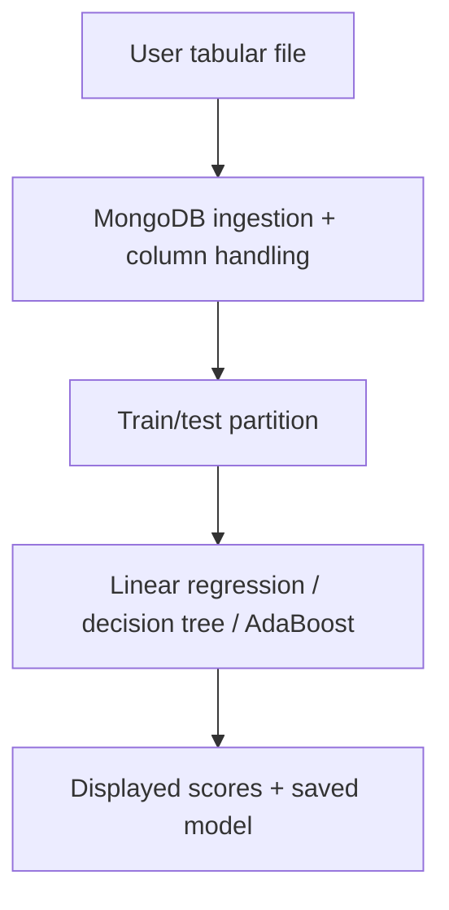

# AutoML: Tabular Model Workbench

Project report | Harsh Saand | 22 September 2026

## The problem

Allow a user to load tabular data, choose a target and compare a small set of models through a browser interface.

## What a user gets

The source implements a Streamlit workflow, MongoDB-backed data handling and model saving through joblib.

## Practical value

The project connects ingestion, model fitting and persistence. It is not evidence of an automated model-search service or an independently evaluated best model.

## Logic and flow

<strong>Data and scope</strong>

The application accepts user data; no fixed attributed benchmark and frozen evaluation manifest is published. Input suitability, feature types and classification versus regression must be decided for the dataset.

<strong>How it works</strong>

ml_utils.py uses a seed-42 train_test_split and implements LinearRegression, DecisionTreeClassifier and AdaBoostClassifier. app.py exposes parameters and save actions. There is no verified broad hyperparameter-search system in the inspected path. Earlier README instructions point to a different repository and an absent Code/app.py path; the code is at the root.

<strong>Results and interpretation</strong>

No reproducible benchmark result is asserted. The UI labels model.score as percentage accuracy for every model. For LinearRegression that score is R-squared, and the displayed fraction is not multiplied by 100; the current labels should not be interpreted as reported percentage accuracy.

<strong>Limitations and next steps</strong>

Use task-appropriate metrics, fix the labels, validate preprocessing leakage and persist trained state reliably across UI reruns. Document the original team contribution before claiming sole authorship.

## Evidence and reproduction references

Source revision: eb7c68a70d3c4bd37ab354633dfe90ad113fefe2

- [README.md](https://github.com/HarshSaand/Auto-Ml/blob/eb7c68a70d3c4bd37ab354633dfe90ad113fefe2/README.md)
- [app.py](https://github.com/HarshSaand/Auto-Ml/blob/eb7c68a70d3c4bd37ab354633dfe90ad113fefe2/app.py)
- [db_utils.py](https://github.com/HarshSaand/Auto-Ml/blob/eb7c68a70d3c4bd37ab354633dfe90ad113fefe2/db_utils.py)
- [ingest.py](https://github.com/HarshSaand/Auto-Ml/blob/eb7c68a70d3c4bd37ab354633dfe90ad113fefe2/ingest.py)
- [ml_utils.py](https://github.com/HarshSaand/Auto-Ml/blob/eb7c68a70d3c4bd37ab354633dfe90ad113fefe2/ml_utils.py)
- [utils.py](https://github.com/HarshSaand/Auto-Ml/blob/eb7c68a70d3c4bd37ab354633dfe90ad113fefe2/utils.py)

This report describes the source and saved evidence at the revision above. Training and full benchmark runs were not repeated for this documentation release. Dataset, model and dependency licences remain separate from the project documentation.
